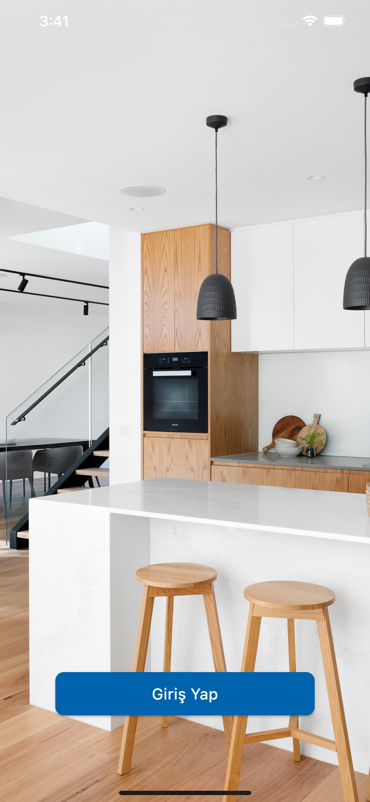
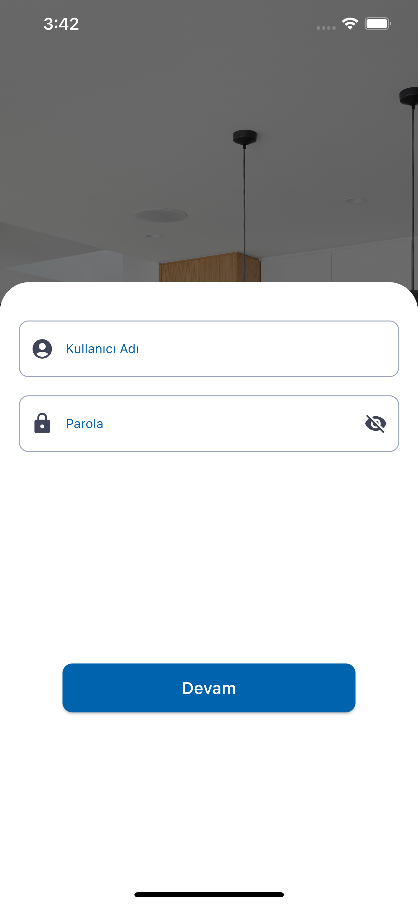
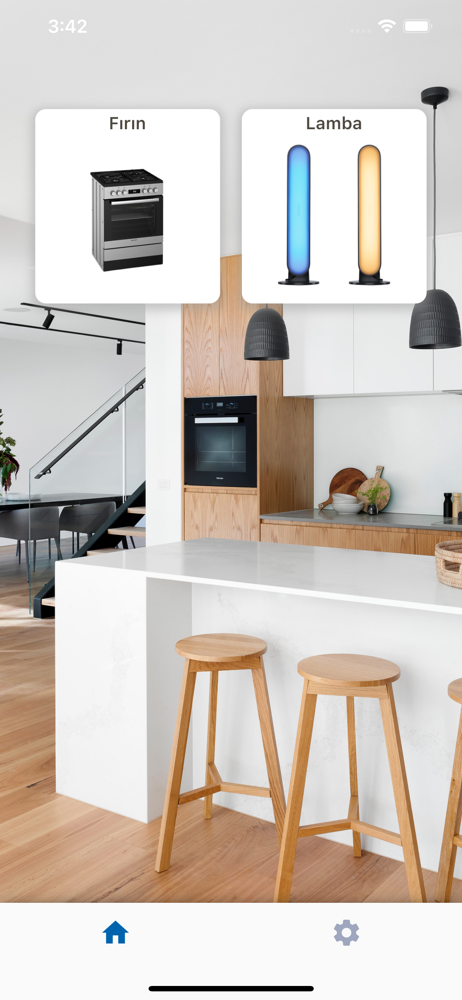
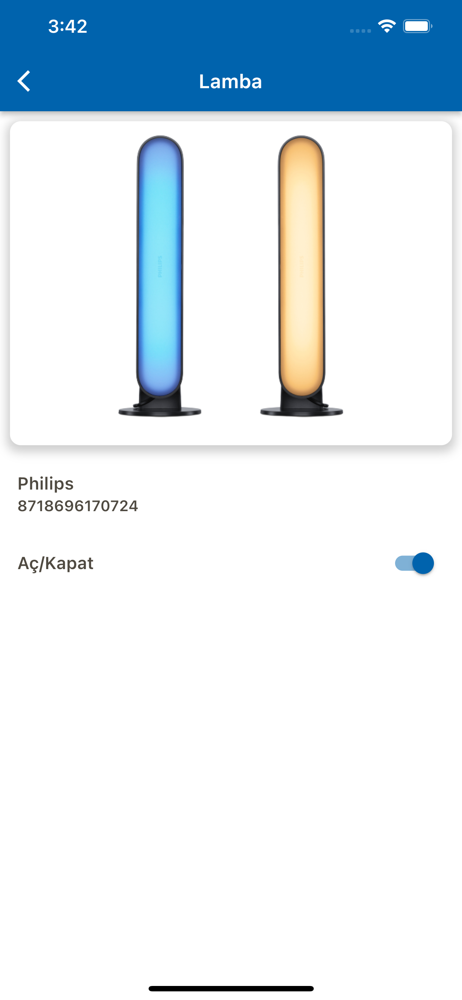
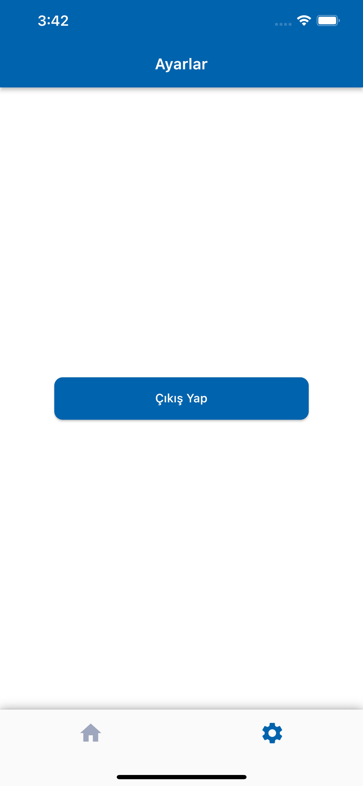

# Flutter - Mobile Case BKS

## Ekran Görüntüleri

### Giriş Ekranı

### Anasayfa

### Ürün Detay

### Ayarlar

## Neler Eklendi :question:

- [x] Giriş Ekranı
- [x] Anasayfa
- [x] Ürün Detay
- [x] Ayarlar
- [x] State Management (Provider)

## Kullanılan Paketler

 #### Utilty
 -kartal,auto_size_text

 #### Widget
 -another_flushbar

 #### State Management
 -provider

 #### Cache
 -shared_preferences
 
